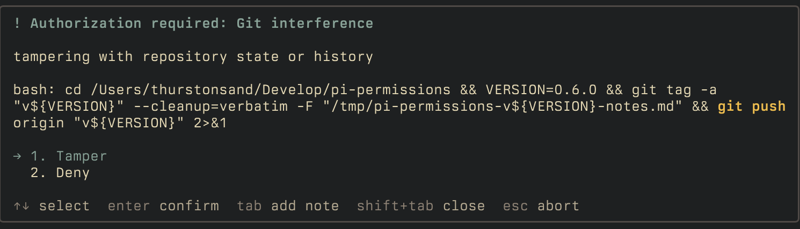
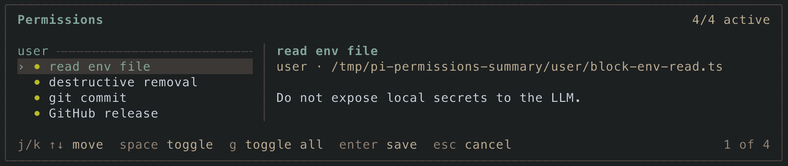

# @thurstonsand/pi-permissions

`pi-permissions` adds a permissions gate for Pi tool calls. You can write small TypeScript modules that inspect a pending tool call and either let it pass, ask the approver, or block it before it runs.

## Install

```bash
pi install npm:@thurstonsand/pi-permissions
```

Restart Pi after installing.

For local development from a clone:

```bash
pi -e ./extensions/index.ts
```

## Where you can write permissions

| Scope   | Location                                           | Loads when                                    |
| ------- | -------------------------------------------------- | --------------------------------------------- |
| User    | `~/.pi/agent/permissions/*.ts`                     | Every session                                 |
| Project | `.pi/permissions/*.ts`                             | The project is trusted                        |
| Package | `pi.permissions` or `permissions/` in a Pi package | The package is installed and not filtered out |

Permission modules are TypeScript modules, using the same basic trust model as Pi extensions. Project permissions only load after Pi trusts the project.

Hooks run in this order:

1. project-level permissions
2. user-level permissions
3. package-level permissions

and stops on the first hook that requests or blocks.

## Writing a permission module

A permission module default-exports a function. Register checks with `api.onToolUse()`:

```ts
import {
  matchTool,
  request,
  type PermissionsAPI,
} from "@thurstonsand/pi-permissions";

const GIT_COMMIT = /\bgit commit\b/;

export default function permissions(api: PermissionsAPI) {
  api.onToolUse({
    name: "git commit",
    description: "Ask before the agent creates a commit.",
    handler(input) {
      return matchTool(input.tool, {
        bash(tool) {
          if (GIT_COMMIT.test(tool.command)) {
            return request({
              guidance: "Review the commit message before approving.",
              highlight: GIT_COMMIT,
            });
          }
        },
      });
    },
  });
}
```

Each hook has:

- `name`: short label shown in prompts and logs
- `description`: explanation shown to the approver if a request is made
- `handler`: code that returns a decision, or returns nothing to keep evaluating other hooks

Handlers receive a `PermissionInput`:

```ts
input.cwd; // current Pi working directory
input.permissionRoot; // directory containing the permission module
input.tool; // normalized tool input
```

For built-in tools, `input.tool` includes typed convenience fields:

```ts
bash.command;
read.projectPath;
edit.absolutePath;
write.path;
```

For custom tools, use `isCustomToolInput()` or the `custom` branch of `matchTool()` to narrow by exact tool name.

Decisions are one of:

```ts
return request(); // default request behavior
return request({
  guidance: "Check the target environment.",
  highlight: /production|prod-db/i,
  approveLabel: "Approve",
  rejectLabel: "Reject",
});
return block("Do not edit generated files directly.");
```

`guidance` adds request-specific text to the prompt. `highlight` emphasizes offending fragments of the tool detail with a string, RegExp, array of either, precomputed spans, or a callback that returns spans. `approveLabel` and `rejectLabel` change the button labels for that request.

A highlight callback receives the rendered tool detail and returns half-open `{ start, end }` offsets. Use `highlightSpans(detail, pattern)` inside a callback when you need pattern matching plus a little extra filtering.

Useful exports:

| Export                          | Use                                                 |
| ------------------------------- | --------------------------------------------------- |
| `PermissionsAPI`                | Type for the module factory argument                |
| `request()`                     | Ask the approver before the tool runs               |
| `block()`                       | Block the tool with an agent-facing reason          |
| `matchTool()`                   | Branch on built-in and custom tool inputs           |
| `highlightSpans()`              | Resolve highlight strings, RegExps, and spans       |
| `parseShellCommand()`           | Parse bash into span-carrying simple commands       |
| `matchCommand()`                | Match bash by program, subcommand, or predicate     |
| `gitValueFlags`                 | Git value-taking flags for subcommand resolution    |
| `isBashToolInput()`             | Narrow a normalized tool input to Pi's `bash` tool  |
| `isReadToolInput()`             | Narrow to Pi's `read` tool                          |
| `isEditToolInput()`             | Narrow to Pi's `edit` tool                          |
| `isWriteToolInput()`            | Narrow to Pi's `write` tool                         |
| `isGrepToolInput()`             | Narrow to Pi's `grep` tool                          |
| `isFindToolInput()`             | Narrow to Pi's `find` tool                          |
| `isLsToolInput()`               | Narrow to Pi's `ls` tool                            |
| `isCustomToolInput(tool, name)` | Narrow to an extension/custom Pi tool by exact name |

## Examples

### Ask before git mutations

```ts
import {
  gitValueFlags,
  matchCommand,
  matchTool,
  request,
  type PermissionsAPI,
} from "@thurstonsand/pi-permissions";

const gitMutations = matchCommand({
  program: "git",
  subcommands: [
    "add",
    "commit",
    "push",
    "checkout",
    "reset",
    "clean",
    "rebase",
  ],
  valueFlags: gitValueFlags,
  onMatch: (match) => request({ highlight: match.spans }),
});

export default function permissions(api: PermissionsAPI) {
  api.onToolUse({
    name: "git mutations",
    description: "Ask before the agent mutates git state.",
    handler(input) {
      return matchTool(input.tool, { bash: gitMutations });
    },
  });
}
```

`matchCommand()` parses shell structure instead of searching raw text, so `echo "git add"` and `git grep add` stay inert while `command git -C /repo add` is caught.

### Ask before recursive forced removal

```ts
import {
  matchCommand,
  matchTool,
  request,
  type SimpleCommand,
  type PermissionsAPI,
} from "@thurstonsand/pi-permissions";

function isDestructiveRemoval(cmd: SimpleCommand): boolean {
  return cmd.programName === "rm"
    ? cmd.hasFlag("-r", "-R", "--recursive") && cmd.hasFlag("-f", "--force")
    : cmd.hasFlag("-delete");
}

const destructiveRemoval = matchCommand({
  program: ["rm", "find"],
  where: isDestructiveRemoval,
  onMatch: ({ commands }) =>
    request({ highlight: commands.map((cmd) => cmd.span) }),
});

export default function permissions(api: PermissionsAPI) {
  api.onToolUse({
    name: "destructive removal",
    description: "Ask before recursive forced removal or find deletion.",
    handler(input) {
      return matchTool(input.tool, { bash: destructiveRemoval });
    },
  });
}
```

`where` narrows matches by an arbitrary predicate the same way `subcommands` narrows by name; `onMatch` only fires when at least one command passes all filters.

### Ask before `git commit`

```ts
import {
  matchTool,
  request,
  type PermissionsAPI,
} from "@thurstonsand/pi-permissions";

const GIT_COMMIT = /\bgit commit\b/;

export default function permissions(api: PermissionsAPI) {
  api.onToolUse({
    name: "git commit",
    description: "The agent should not create commits without approval.",
    handler(input) {
      return matchTool(input.tool, {
        bash(tool) {
          if (GIT_COMMIT.test(tool.command))
            return request({ highlight: GIT_COMMIT });
        },
      });
    },
  });
}
```

### Block reading `.env`

```ts
import {
  block,
  matchTool,
  type PermissionsAPI,
} from "@thurstonsand/pi-permissions";

export default function permissions(api: PermissionsAPI) {
  api.onToolUse({
    name: "read env file",
    description: "Do not expose local secrets to the LLM.",
    handler(input) {
      return matchTool(input.tool, {
        read(tool) {
          if (tool.projectPath === ".env") {
            return block("Reading .env could expose local secrets to the LLM.");
          }
        },
      });
    },
  });
}
```

### Ask before a direct pi-mcp-adapter tool

[`pi-mcp-adapter`](https://github.com/nicobailon/pi-mcp-adapter) can expose MCP tools directly as Pi tools. If a GitHub MCP server exposes a direct tool named `github_create_release`, you can match it like any other Pi tool.

```ts
import {
  matchTool,
  request,
  type PermissionsAPI,
} from "@thurstonsand/pi-permissions";

export default function permissions(api: PermissionsAPI) {
  api.onToolUse({
    name: "GitHub release",
    description: "Ask before creating a release through pi-mcp-adapter.",
    handler(input) {
      return matchTool(input.tool, {
        custom: {
          github_create_release(tool) {
            return request({
              guidance: `Check the tag, target repository, and release notes.\n\n${tool.detail}`,
              approveLabel: "Create release",
              rejectLabel: "Cancel release",
            });
          },
        },
      });
    },
  });
}
```

## Package-bundled permissions

A Pi package can ship permissions alongside the pi-native extensions, skills, prompts, or themes.

```json
{
  "name": "my-pi-package",
  "pi": {
    "extensions": ["./extensions/index.ts"],
    "permissions": ["./permissions/index.ts"]
  }
}
```

If `pi.permissions` is omitted, `pi-permissions` also checks for a top-level `permissions/` directory.

And you can choose exactly which permissions to use in your pi settings where you declare that package:

```json
{
  "packages": [
    {
      "source": "npm:my-pi-package",
      "permissions": ["permissions/*.ts", "!permissions/legacy.ts"]
    }
  ]
}
```

An empty `permissions` array disables permissions from that package.

## Approval prompts

When a hook returns `request()`, Pi shows the approver a prompt before the tool runs. If the request includes `highlight`, matching tool-detail fragments render in warning color and bold.



Approving runs the tool. If the approver adds a note, that note is passed back into the session as context.

Rejecting blocks the tool. A rejection with a note tells the agent how to proceed; a rejection without a note aborts the current turn. Hitting `esc` also aborts the turn.

## Managing permissions

Use `/permissions` to review loaded hooks and choose which permission checks are enabled in the current session branch.



Inside the permissions modal:

- `j`/`k` or arrow keys navigate
- `space` toggles the selected permission
- `g` toggles all currently loaded permissions
- `enter` saves and closes
- `esc` closes without saving

Commands:

```text
/permissions
/permissions enable
/permissions disable
/permissions enable Git mutations
/permissions disable Git mutations
```

`/permissions enable` and `/permissions disable` apply to all permissions.

You can also toggle all currently loaded permissions via `Alt+P`, customizable in `~/.pi/agent/settings.json`:

```json
{
  "permissions": {
    "toggleShortcut": "alt+p"
  }
}
```

Run `/reload` after changing settings.

## Development

This repo uses mise for local commands.

```bash
mise run check
mise run test
```

Run Pi against the local extension entrypoint:

```bash
pi -e ./extensions/index.ts
```
