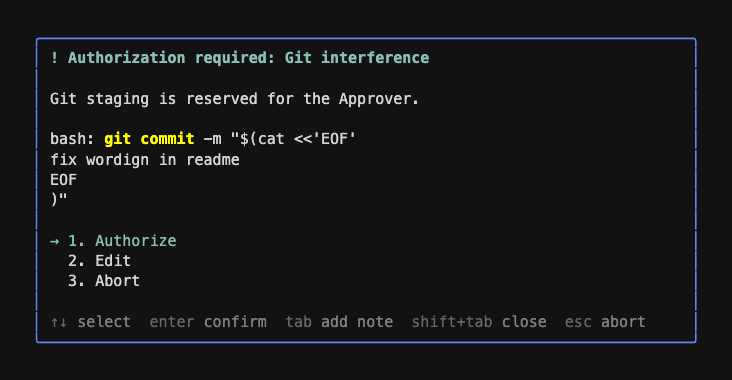
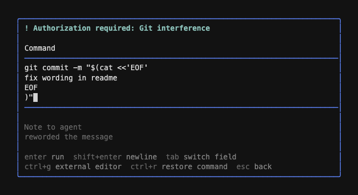
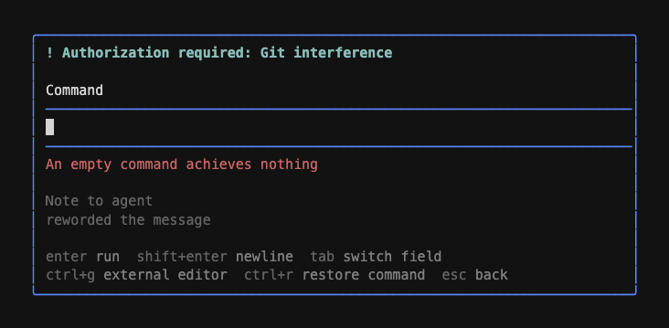

# Edit command at the prompt

## Status

Accepted

Builds on design 01 (prompt anatomy), design 04 (matcher-less hooks), and design 05 (prompt highlight). Terminology per `CONTEXT.md`: Edit, Note, Approver, Prompt.

## Decision Summary

The permission prompt gains a third outcome for bash tool calls: Edit. The Approver rewrites the command in a multiline editor before execution; submitting runs the edited command immediately, without re-evaluating permission hooks, and the agent learns the true command through a note prepended to the tool result. The tradeoff: the transcript's assistant message still shows the original command — pi offers no way to rewrite it — so the tool result note is the sole correction channel, accepted in exchange for building entirely on pi's documented `tool_call` input-mutation contract.

## Problem Statement / Background

The agent frequently embeds prose in bash commands — the canonical case is `git commit -m "$(cat <<'EOF' ... EOF)"`. When a permission hook prompts on such a command, the Approver's only options are approve as-is or reject and re-explain the wording change in a note, then review the retry. That round trip costs a full agent turn to fix a two-word edit the Approver could have typed directly.

Pi supports this natively: the `tool_call` extension event documents that `event.input` is mutable and that mutating it in place patches the tool arguments before execution (`packages/coding-agent/src/core/extensions/types.ts:871`, pi v0.80.3). The executed args are a `structuredClone` of the assistant message's `toolCall.arguments` (`packages/ai/src/utils/validation.ts:293`), which means mutation changes what runs but the transcript and the TUI tool-call rendering keep the original command. Without an explicit correction, the agent would believe the original command ran — unacceptable when the output (a commit hash, a changed message) contradicts it.

## Goals

- Let the Approver rewrite a bash command inline at the prompt, then run it immediately.
- Guarantee the agent learns the exact command that ran, adjacent to that command's output.
- Support multiline commands (heredoc commit messages) with a real editor, including escape to `$EDITOR`.
- Let the Approver attach an optional note to an edit, visually distinct from the command — dim, like git's comment lines.
- Preserve edit drafts across a cancel: escape backs out to the prompt without losing work.

## Non-Goals

- Editing non-bash tool calls. The choice does not render for read/edit/write/grep/find/ls or custom tools.
- Re-evaluating permission hooks against the edited command.
- Rewriting the transcript or the TUI rendering of the original tool call — pi provides no mechanism.
- Multiline notes. The note is a single line, matching the scope of the existing prompt notes.

## Exposed Shape

One Author-facing addition: `PermissionRequestPrompt` gains `editLabel?: string`, defaulting to `"Edit"`, alongside the existing `approveLabel`/`rejectLabel` customization. Everything else is Approver-facing surface.

```ts
interface PermissionRequestPrompt {
  guidance?: string;
  highlight?: PermissionHighlight;
  approveLabel?: string;
  rejectLabel?: string;
  editLabel?: string; // bash tool calls only; ignored otherwise
}
```

### Prompt, select mode (bash tool calls)



Non-bash tool calls render the existing two choices unchanged. The detail line previews what the highlighted choice would run: Authorize and Abort show the agent's original command with its decision-time highlight; Edit shows the live edited buffer, rendered plain — highlights are computed once against the proposed command and are never applied to edited text.

### Prompt, edit mode

Choices are ordered Authorize, Edit, Abort. Selecting `2. Edit` (via enter, or the `2` shortcut) switches the same overlay into edit mode. Edit mode **replaces the prompt content in place** — same overlay component, same bordered box, same screen position. It is not a separate centered modal.



Submitting a blank command does not run; a warning renders below the command field until the next keystroke:



> The mocks are rendered with the actual pi-tui `Editor` component and pi's dark-theme colors (`packages/coding-agent/src/modes/interactive/theme/dark.json`); minor layout drift during implementation is expected.

- **Command** is a pi-tui `Editor` (multiline), prefilled with the original command, normal text color. The horizontal rules above and below it are the `Editor`'s own framing.
- **Note to agent** is a single-line field rendered dim (`theme.fg("dim", ...)`), reusing the overlay's existing draft-editing input handling.
- `tab` toggles focus between the two fields. `enter` from either field submits. `shift+enter` inserts a newline in the command editor. `ctrl+g` opens the focused field's content in `$EDITOR`. `ctrl+r` toggles the command buffer between the Approver's edits and the agent's original, stashing whichever is not shown; modifying the buffer while the original is shown discards the stash. The note is untouched either way. `esc` returns to select mode with both drafts retained.
- `ctrl+r` is safe to claim: pi-tui's editor binds undo to `ctrl+-`, and pi's `app.session.rename` (`ctrl+r`) never reaches a focused overlay.

### Behavior contract

| Approver action                                        | Result                                                                                                                                      |
| ------------------------------------------------------ | ------------------------------------------------------------------------------------------------------------------------------------------- |
| Edit mode, submit with a changed command               | Edited command runs immediately; no hook re-evaluation; agent gets an edit note in the tool result; human gets a succinct notify            |
| Edit mode, submit with the command unchanged           | Plain approval. With a note: approve-with-note using the existing approval-note format. Without: silent approval, no note to the agent      |
| Edit mode, esc, then Authorize                         | Edits discarded; the original command runs                                                                                                  |
| Edit mode, esc, then Edit again                        | Command and note drafts restored exactly as left                                                                                            |
| Edit mode, `ctrl+r`                                    | Command buffer toggles between edits and the agent's original (single-slot stash); modifying while the original is shown discards the stash |
| Select mode, tab-note on the Edit choice, then enter   | The typed text seeds the note field in edit mode (they are the same draft)                                                                  |
| Edit mode, submit with a blank/whitespace-only command | Nothing runs; a warning renders below the command field in `error` color, cleared on the next input                                         |

### Agent-facing edit note (prepended to the tool result)

```text
Edited by user via permission hook <hookName>

The user edited this command before execution. The command that actually ran:
<edited command>
```

With a note, one additional section — omitted entirely otherwise:

```text
The user also provided context for how to proceed:
<note>
```

## Design Decisions

### 1. Bash only

The prompt renders a single `detail` string, and for bash that string _is_ the input: mapping the edited text back is `event.input.command = text`. Other fields of `BashToolInput` (e.g. `timeout`) are untouched. For file and custom tools the input is structured JSON; editing it means raw-JSON editing with no re-validation after mutation (pi's documented behavior) — error-prone for marginal value, since the agent retries path corrections cheaply. Additive to extend later.

The choice label is Author-customizable via `editLabel`, mirroring `approveLabel`/`rejectLabel` — no reason the third label should be the rigid one. Default `"Edit"`. On non-bash tool calls the field is ignored, consistent with the choice not rendering.

### 2. Edit implies approval; no hook re-evaluation

The Approver just authored the command character-by-character — a second confirmation is ceremony, and re-running hooks against human-authored input invites prompt loops (edit → new prompt → edit). This follows the project ethos: hooks exist for workflow semantics, not security, and the Approver's own hand outranks any hook. Consequence: an edit can deliberately produce a command another hook would have gated (e.g. adding `git add` to a commit); that is the Approver exercising their own workflow, not a bypass. Note that later `tool_call` handlers in _other_ extensions still see the mutated input — pi runs them after ours — so this decision only waives re-evaluation within this extension.

### 3. Mutation via pi's documented contract; the tool result note is the correction channel

The hooks handler mutates `event.input.command` in place, exactly as pi's `ToolCallEvent` doc prescribes. Because the executed args are a `structuredClone` of `toolCall.arguments`, the assistant message — and therefore the agent's context and the TUI tool-call rendering — retains the original command. The existing `PendingApprovalNotes` → `tool_result` pipeline (design 01) already prepends Approver text to tool results and is branch-safe (discarded on `turn_end`); the edit note rides the same channel, placing the true command directly adjacent to its output. A succinct `ctx.ui.notify` covers the human side, since the notify is transient and the human already watched themselves edit.

### 4. One overlay component, two modes — not chained `ctx.ui.custom` calls

Edit mode lives inside `PermissionPromptOverlay` as an internal mode switch (`select` | `edit`), not as a second overlay opened by `hooks.ts` after the gate resolves. A chained design would force `hooks.ts` into a loop — reopen the gate on editor cancel, thread drafts back and forth through gate results — and flicker between overlays. With an internal mode, draft retention across esc is free (the component instance never dies until a terminal outcome), and `hooks.ts` sees exactly one gate call returning one result. Consequence: the `esc` handler must become mode-aware — today `isCancel` aborts from anywhere; in edit mode it must return to select mode instead.

### 5. Two fields, not a sentinel-delimited buffer

The git-COMMIT_EDITMSG approach — one buffer, a magic delimiter line, everything below it is the note — was seriously considered and lost on the dimming requirement. pi-tui's `Editor` has no per-line styling hook; dimming the note _section_ of one buffer means subclassing `Editor` and post-processing `render()` output against private scroll state — fragile across pi upgrades, plus sentinel collision/stripping concerns. Dimming a whole separate field is a `theme.fg("dim", ...)` wrap around its rendered line. Two fields also keep the data model clean (command and note never mix, no parsing) and make note re-editing natural.

### 6. Multiline `Editor` for the command; the existing single-line draft input for the note

The command editor is pi-tui's exported `Editor` (`import { Editor } from "@earendil-works/pi-tui"`): it provides multiline editing, enter-submits/shift+enter-newline, bracketed paste, undo, and kill-ring for free. Constructed with the `tui` instance the `ctx.ui.custom` factory already provides, plus an `EditorTheme` (`borderColor` + `SelectListTheme`) built from the overlay's theme — the select-list part only styles autocomplete, which never triggers here. `editor.setText(original)` prefills; `editor.onSubmit` and `editor.getText()` drive submission; `editor.focused` gates cursor rendering. The note field deliberately reuses the overlay's existing grapheme-aware draft-input code (`handleDraftInput` and friends) rather than a second `Editor`: single-line matches the scope of the existing prompt notes, and the dim styling is trivial there.

### 7. The edit choice's tab-draft _is_ the note field

In select mode, `tab` on the Edit choice opens the same inline draft input the yes/no choices have. That draft and edit mode's note field share one backing draft (`drafts.edit`), so seeding is not a transfer step — they are the same state, satisfying the seeding rule by construction.

### 8. Unchanged command degrades to plain approval

If the submitted text equals the original command, no mutation occurs and no edit note is sent — with a note it becomes a standard approve-with-note (`formatAgentFacingApprovalNote`), without one it is a silent approval. Telling the agent "the user edited this command" when nothing changed would be false; the edit format is reserved for actual edits.

### 9. External editor support is copied, not imported

`ctrl+g` → `$EDITOR` matters most for exactly this feature's motivating case (rewording a commit message in vim). Pi implements it in `ExtensionEditorComponent.openExternalEditor` (`packages/coding-agent/src/modes/interactive/components/extension-editor.ts`), which is **not exported**. The ~50-line routine is self-contained — tmpfile write, `tui.stop()`, async `spawn` with `stdio: "inherit"`, read back, `tui.start()` + forced re-render — and is copied into this repo, adapted to write the tmpfile with a `.sh` suffix. The keybinding id is `app.editor.external`; the coding-agent `KeybindingsManager` passed to the `ctx.ui.custom` factory resolves it. Drift risk accepted: the routine touches only stable pi-tui surface (`stop`/`start`/`requestRender`).

## Edge Cases & Failure Modes

- **Blank or whitespace-only command submitted:** Nothing runs; a warning line ("An empty command achieves nothing", theme `error` color) renders below the command field and clears on the next input. An empty bash command is never what the Approver meant, and silent refusal would read as a dead enter key.
- **Esc pressed in edit mode:** Returns to select mode, drafts retained. Only esc in select mode aborts — the current unconditional `isCancel` → abort must be scoped.
- **Esc from edit mode, then Authorize:** The approve path never reads the drafts; the original, unmutated command runs.
- **Tab inside the command editor:** Intercepted by the overlay for field-switching before forwarding input to the `Editor`; a literal tab cannot be typed in the command field. Acceptable — commands with meaningful tabs can be authored via `ctrl+g`.
- **Note contains only whitespace after trim:** Treated as absent everywhere a note is optional.
- **External editor exits non-zero or fails to spawn:** Buffer unchanged, TUI resumes — same handling as pi's own routine.
- **Three-choice navigation:** `moveSelection` currently toggles between two hardcoded choices; it generalizes to ordered-list navigation (`↑`/`k`, `↓`/`j`, number shortcuts `1`–`3`). Number shortcuts keep the existing `tabUsed` semantics (select-only after a tab-draft session has begun).
- **No UI available:** Unchanged from design 01 — the tool call is blocked with the no-UI reason; edit mode is unreachable.
- **Branch/fork/turn end with an outstanding edit note:** `PendingApprovalNotes.discardOutstandingNotes()` already clears on `turn_end` and session restore events; edit notes ride the same store and inherit the guarantee.
- **TUI rendering of the running tool call shows the original command:** Known and accepted (Decision 3). The human sees the succinct notify; the agent sees the edit note in the result.

## Alternatives

### Sentinel-delimited single buffer (git COMMIT_EDITMSG style)

- **Status:** Rejected
- **Decision:** Lost to Decision 5 — per-line dimming inside one `Editor` requires subclassing and scroll-aware post-processing of `render()` output against private state, and the sentinel needs collision-safe parsing. The two-field layout reaches the same visual (dim note, normal command) for a fraction of the fragility.
- **Discussion:** Otherwise attractive: one editing surface, note-after-edit for free, a convention git already trained everyone on. Would become viable if pi-tui ever exposes per-line styling.

### `ctx.ui.editor` for the command, second prompt for the note

- **Status:** Rejected
- **Decision:** `ctx.ui.editor` is a closed box — enter/shift+enter/esc/ctrl+g only, no second field, no styling hooks. A trailing "note? (enter to skip)" stage taxes every edit, and note re-editing (edit → realize the note needs changing) has no path back.

### Chained overlays orchestrated by `hooks.ts`

- **Status:** Rejected
- **Decision:** Gate returns "edit requested", `hooks.ts` opens an editor overlay, cancel reopens the gate. Forces a state-threading loop through gate results and flickers overlays; the internal mode switch (Decision 4) keeps one gate call and gets draft retention for free.

### Re-evaluate hooks against the edited command

- **Status:** Rejected
- **Decision:** Safest-looking, but contradicts the ethos (hooks are workflow semantics, not security), and invites edit → prompt → edit loops. The Approver authored the command; no hook's judgment supersedes that.

### Custom submit chords (enter = run, alt-chord = add note)

- **Status:** Rejected
- **Decision:** Requires a custom editor either way — `ctx.ui.editor` exposes no extra keybindings — and once the two-field overlay exists, a mode-launching chord is strictly worse than the note field simply being present. `shift+enter` specifically is unavailable: it is newline in pi's editor.

## Implementation Plan

Pi source references are against `~/.cache/pi-source/v0.80.3`.

- [x] Phase 1: Gate result, presentation, pending notes
  - Goal: The pure layers speak "edit" — result type, agent/human-facing formats, and the pending-note store — with no UI changes yet.
  - Files: `src/ui/permission-prompt.ts` (types only), `src/api.ts`, `src/presentation.ts`, `src/pending-approvals.ts`, `test/presentation.test.ts`, new or extended pending-notes coverage.
  - Work: Extend `PermissionGateResult` with `{ kind: "edit"; command: string; note?: string }`. Add `editLabel?: string` to `PermissionRequestPrompt` in `src/api.ts` and thread it through `formatHumanFacingPermissionPrompt` with default `"Edit"`, as `approveLabel`/`rejectLabel` already are. Add `formatAgentFacingEditNote({ hookName, command, note? })` producing the format in Exposed Shape (note section only when present) and `formatHumanFacingEditNotification(hookName)` for the succinct notify. Generalize `PendingApprovalNotes` to store a discriminated union (approval | edit) keyed by toolCallId — keep `discardOutstandingNotes` semantics — and have the formatting choice live in `presentation.ts`, not the store. Tests assert exact text shapes, including note-section omission.
  - Validation: `mise run check`.

- [x] Phase 2: Overlay edit mode
  - Goal: The prompt offers `2. Edit` (or the Author's `editLabel`) for bash and the full edit-mode interaction works, returning the new result kind.
  - Files: `src/ui/permission-prompt.ts`, new `src/ui/external-editor.ts`, `extensions/hooks.ts` (pass-through of tool name / original command into `showPermissionGate`).
  - Work: Generalize choice handling from the `yes`/`no` pair to an ordered choice list — Authorize, Edit, Abort — including `edit` only when the gated tool is bash (thread `toolName`/original command through `showPermissionGate`'s signature). Implement the `select`/`edit` mode switch per Decision 4, scoping esc/abort to select mode. Build edit mode per the Exposed Shape layout: pi-tui `Editor` (`packages/tui/src/components/editor.ts`; exported as `Editor`, `EditorOptions`, `EditorTheme`) prefilled via `setText`, an `EditorTheme` constructed from the overlay theme, `onSubmit` wired to submission, `focused` managed on field switch; note field reusing the existing draft-input code rendered dim; `tab` intercepted for field toggle before forwarding to the editor. Enforce the behavior contract rows: unchanged-command degrade (compare submitted text to original), blank-command ignore, draft retention across esc, shared `drafts.edit` backing the tab-draft and the note field, `ctrl+r` restore-to-original (command buffer only), and the blank-command warning line ("An empty command achieves nothing", theme `error` color, cleared on next input). Render edit mode inside the same bordered box in place of the select-mode content — one component, one position. Copy `openExternalEditor` from `packages/coding-agent/src/modes/interactive/components/extension-editor.ts` into `src/ui/external-editor.ts` (tmpfile with `.sh` suffix, `tui.stop()`/`start()`/`requestRender(true)`), triggered by `keybindings.matches(data, "app.editor.external")` on the focused field.
  - Validation: `mise run check`; smoke test per `DEV.md` — a bash-gating hook, walk every behavior-contract row manually, including a heredoc commit message and `ctrl+g` into `$EDITOR`.

- [x] Phase 3: Execution wiring and docs
  - Goal: Submitting an edit mutates the command, runs it, and both audiences see the truth.
  - Files: `extensions/hooks.ts`, `README.md`.
  - Work: Handle the `edit` result kind in `handlePromptResult`: set `event.input.command` to the edited text (mutation contract per `packages/coding-agent/src/core/extensions/types.ts:871`), remember the edit note via `PendingApprovalNotes`, emit the succinct notify, return `undefined` (approve). The existing `tool_result` handler formats the union from Phase 1. Document the Edit outcome in the README's prompt section.
  - Validation: `mise run check`; smoke test evidence — agent asked to `git commit` with a typo'd message, Approver edits the wording, verify: the edited command actually ran (`git log -1`), the tool result the agent received leads with the edit note and true command, the notify appeared, and a rejected/esc'd edit leaves the original command running untouched.
